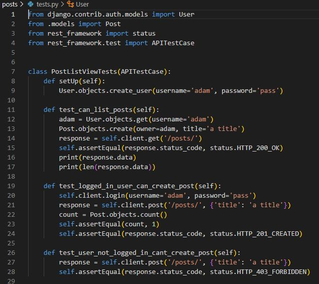
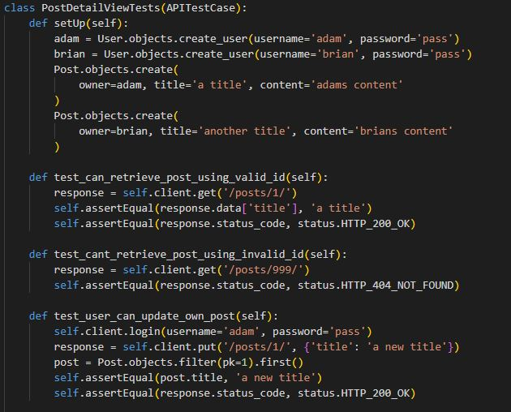
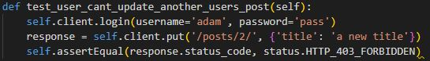

# CONSOLE GEEKS - API

## Links to Repositories and Live Sites

[Live site for the Back End](https://ck-fsd-console-geeks.herokuapp.com/)

[Live site for the Front End](https://ck-fsd-console-geeks-pp5.herokuapp.com/)

[Front End Respository](https://github.com/ChrisKellFSD/console-geeks)

### Contents

- [Design](<#design>)
	- [User Stories](<#user-stories>)
	- [Database Schema](<#database-schema>)
	- [Details](<#details>)
- [Technologies](<#technologies>)
	- [Development Technologies](<#development-technologies>)
- [Django](<#django>)
	- [Project Setup](<#project-setup>)
	- [Custom API with DRF](<#custom-api-with-drf>)
	- [JWT Tokens](<#jwt-tokens>)
- [Deployment](<#deployment>)
    - [Heroku](<#heroku>)
- [Testing](<#testing>)
	- [Automated Testing](<#automated-testing>)
	- [Manual Testing](<#manual-testing>)
	- [Validation](<#validation>)
- [Credits and Resources](<#credits-and-resources>)
	- [Code](<#code>)

## Design

### User Stories
The API was designed using the back end to achieve the user stories mentioned in the front end of the 'Console Geeks' project. The backend focuses on administration and can be described as one user story:

<em>"As an admin, I want to be able to create, edit and delete the users, posts, comments and likes, so that I can have full control the application using its CRUD features."</em>

### Database Schema
The database was built using the Django Rest Framework. It makes use of Django models, serializers, and views. The Data Schema was designed as shown below:


### Details

<details><summary>User</summary>

- One-to-one relation with the Profile model owner field
- ForeignKey relation with the Post model owner field
- ForeignKey relation with the Follower model owner_following and followed fields
- ForeignKey relation with the Comment model owner field
- ForeignKey relation with the Like model owner field
- ForeignKey relation with the Favourite model owner field
- ForeignKey relation with the Contact model owner field</details>

<details><summary>Profile</summary>

- The Profile model contains the following fields: ID, owner, created_at, updated_at, name, content and image
- One-to-one relation between the owner field and the User model id field</details>

<details><summary>Post</summary>

- The Post model contains the following fields: ID, owner, created_at, updated_at, title, content, category and image
- ForeignKey relation with the Comment model post field
- ForeignKey relation with the Like model post field
- ForeignKey relation with the Favourite model post field</details>

<details><summary>Follower</summary>

- The Follower model contains the following fields: ID, owner, following and created_at
- ForeignKeyUser relation between the following and the User model id field
- ForeignKeyUser relation between the followed field and the User model post field</details>

<details><summary>Comment</summary>

- The Comment model contains the following fields: ID, owner, post, created_at, updated_at and content
- ForeignKeyUser relation between the owner field and the User model id field
- ForeignKeyUser relation between the post field and the User model post field</details>

<details><summary>Like</summary>

- The Like model contains the following fields: ID, owner, post and created_at
- ForeignKey relation between the ID field and the User model id field
- ForeignKey relation between the owner field and the User model id field
- ForeignKey relation between the post field and the Post model post field</details>

<details><summary>Favourite</summary>

- The Favourite model contains the following fields: ID, owner, post and created_at
- ForeignKey relation between the ID field and the User model id field
- ForeignKey relation between the owner field and the User model id field
- ForeignKey relation between the post field and the Post model post field</details>

<details><summary>Contact</summary>

- The Contact model contains the following fields: ID, owner, name, subject and message
- ForeignKey relation between the ID field and the User model id field
- ForeignKey relation between the owner field and the User model id field</details>

### Development Technologies

**Languages**
- [Python](https://en.wikipedia.org/wiki/Python_(programming_language))

**Frameworks & Libraries**

- [Django](https://www.djangoproject.com/)
- [Cloudinary](https://cloudinary.com/)
- [Pillow](https://python-pillow.org/)
- [Django rest auth](https://django-rest-auth.readthedocs.io/en/latest/)
- [Django Rest Framework](https://www.django-rest-framework.org/)
- [django-filter](https://django-filter.readthedocs.io/en/stable/)

**Tools**

- [Figma](https://figma.com/)
- [Gitpod](https://www.gitpod.io/)
- [Git](https://git-scm.com/)
- [GitHub](https://github.com/)
- [Heroku](https://www.heroku.com/)
- [Random Key Generator](https://randomkeygen.com/)

[Back to top ⇧](#contents)

## Django

### Project Setup
Django Rest Framework (DRF) was used to create this API. DRF project was set up and many necessary dependencies were installed following these steps:

1. Within your development environment/terminal, install Django with: `pip3 install 'django<4'` to install Django framework.
2. The code at terminal `pip3 install <package>` was used to install different dependencies:
- `pip3 install django-cloudinary-storage`- for Cloudinary to store uploaded image files
- `pip3 install Pillow` - To allow ImageFields to be used in the database models
- `pip3 install djangorestframework`- To install Django Rest Framework

3. Once these dependencies are installed, requirements.txt is updated using: `pip3 freeze > requirements.txt`. 
4. New Django project using the command `django-admin startproject <your-project-name> .` (dot at the end is necessary create it in root directory).
5. Add your installed apps to the `settings.py` file INSTALLED_APPS variable. The required lines are:
~~~
'cloudinary_storage',
'cloudinary',
~~~
6. To configure cloudinary, the following variables need to be set in settings.py: 
- `CLOUDINARY_STORAGE`: this should be set to your own cloudinary URL. Create env.py file in root directory and create a`CLOUDINARY_URL` environment variable in an env.py file like this
~~~
import os

os.environ['CLOUDINARY_URL'] = 'cloudinary:<url from personal cloudinary account>
~~~

and import this into the settings.py file using:
~~~
import os
if os.path.exists('env'):
    import env
~~~
 
`CLOUDINARY_STORAGE` is to be set to: `{'CLOUDINARY_URL': os.environ.get('CLOUDINARY_URL')}` which retrieves the env.py variable in a development environment, but also allows a Config Var to be set in Heroku for later deployment to Heroku.

- `MEDIA_URL`: this is set to '/media/' in this project
- `DEFAULT_FILE_STORAGE`: is to be set to 'cloudinary_storage.storage.MediaCloudinaryStorage'

7. . Whilst in the `env.py` file, create a `SECRET_KEY` variable which will be used later for Heroku deployment. To generate a new Django secret key, do a google search for a random key generator and use one of the results to create a key. The variable can be created using: 
~~~
os.environ ["SECRET_KEY"] = "<copy and paste the secret key>"
~~~
Back in settings.py, find the `SECRET_KEY` variable and replace the assignment as follows:
~~~
SECRET_KEY = os.environ.get('SECRET_KEY')
~~~
At the terminal
~~~
git add .
git commit -m "initial commit"
git push
~~~

- App Creation
After creation of new App using `python3 manage.py startapp <app>`, it must be added to installed apps in settings.py.

- Once the database models are created in 'models.py' file, they must be registered in 'admin.py' file of the respective app directory. Later the migrations must be made to the database.

## Project Deployment

### Set up JSON Web Tokens
1. Run terminal command `pip install dj-rest-auth` to install JSON web token authenication
2. Add 'rest_framework.authtoken' and 'dj_rest_auth' to INSTALLED_APPS list in settings.py:
```
INSTALLED_APPS = [
    'django.contrib.admin',
    'django.contrib.auth',
    'django.contrib.contenttypes',
    'django.contrib.sessions',
    'django.contrib.messages',
    'cloudinary_storage',
    'django.contrib.staticfiles',
    'cloudinary',
    'rest_framework',
    'django_filters',
    'rest_framework.authtoken',
    'dj_rest_auth',
]
```  
3. Add the dj_rest-auth url paths to the main url.py file:
'''
urlpatterns = [
    path('', root_route),
    path('admin/', admin.site.urls),
    path('api-auth/', include('rest_framework.urls')),
    path('dj-rest-auth/', include('dj_rest_auth.urls')),
]
'''
4. Run terminal command `python manage.py migrate` to migrate database
5. Install Django AllAuth with terminal command `pip install dj-rest-auth[with_social]` for user registration set up
6. Add below INSTALLED_APPS to settings.py:
```
'django.contrib.sites',
    'allauth',
    'allauth.account',
    'allauth.socialaccount',
    'dj_rest_auth.registration',
```
7. Set the SITE_ID in settings.py:
```
SITE_ID = 1
```
8. Add below registration url to main urls.py file:
``` 
path(
        'dj-rest-auth/registration/', include('dj_rest_auth.registration.urls')
    ),
```
9. Run command `pip install djangorestframework-simplejwt` to install JSON tokens
10. In env.py set [DEV] variable:
```
os.environ['DEV'] = '1'
```
11. Add below code to settings.py to check if your project is in development or production:
```
REST_FRAMEWORK = {
    'DEFAULT_AUTHENTICATION_CLASSES': [(
        'rest_framework.authentication.SessionAuthentication'
        if 'DEV' in os.environ
        else 'dj_rest_auth.jwt_auth.JWTCookieAuthentication'
    )],
}
```
12. Set REST_USE_JWT to enable token authentication:
```
REST_USE_JWT = True
```
13. Set JWT_AUTH_SECURE to ensure tokens are only sent over secure HTTPS:
```
JWT_AUTH_SECURE = True
```
14. Set Cookies for access token and refresh token:
```
JWT_AUTH_COOKIE = 'my-app-auth'
JWT_AUTH_REFRESH_COOKIE = 'my-refresh-token'
```
15. Create a serializers.py file in your main drf directory e.g. pp5_gamer_verse_drf_api and copy the UserDetailsSerializer code from the Django documentation:
```
from dj_rest_auth.serializers import UserDetailsSerializer
from rest_framework import serializers


class CurrentUserSerializer(UserDetailsSerializer):
    """Serializer for Current User"""
    profile_id = serializers.ReadOnlyField(source='profile.id')
    profile_image = serializers.ReadOnlyField(source='profile.image.url')

    class Meta(UserDetailsSerializer.Meta):
        """Meta class to to specify fields"""
        fields = UserDetailsSerializer.Meta.fields + (
            'profile_id', 'profile_image'
        )
``` 
16. Overwrite the default user detail serializer in settings.py:
```
REST_AUTH_SERIALIZERS = {
    'USER_DETAILS_SERIALIZER': 'drf_api.serializers.CurrentUserSerializer'
}
```
17. Run terminal command `python manage.py migrate` to migrate database again
18. Run terminal command `pip freeze > requirements.txt` to update your requirements.txt file with the latest packages
19. `git add .`, `git commit -m "Message"` and `git push` changes

### Deploying to Heroku
1. Commit all changes and push them to GitHub
2. Log in to Heroku or create a new account
3. From the Heroku dashboard click the "Create New App" button
4. Enter the name of your app and the region you're located in. Then click "Create App". It is worth noting that your app name must be unique for Heroku to accept it
5. In your app go to the Resources tab and add a Heroku Postgres database. This can be done by searching for Postgres in the Add-ons search box, select Heroku Postgres and choose the HobbyDev - Free option and submit
6. Click on the "Settings" tab and scroll down to reveal config vars and confirm the database URL is there
7. Navigate back to your code in GitPod or whatever IDE your using. Run terminal command `pip install dj_database_url psycogpg2` to install libraries needed to used Heroku PostgreSQL database
8. Import dj_database_url to settings.py:
```
import dj_database_url
```
9. In settings.py, navigate to the DATABASES section and seperate the development and production environments:
```
DATABASES = {
    'default': ({
        'ENGINE': 'django.db.backends.sqlite3',
        'NAME': BASE_DIR / 'db.sqlite3',
    } if 'DEV' in os.environ else dj_database_url.parse(
        os.environ.get('DATABASE_URL')
    ))
}
```
10. Run terminal command `pip install gunicorn` to install the Gunicorn library
11. Add a Procfile to the root directory and add the below code to it:
```
release: python manage.py makemigrations && python manage.py migrate
web: gunicorn pp5_gamer_verse_drf_api.wsgi
```
12. Add the following ALLOWED_HOSTS in settings.py:
```
ALLOWED_HOSTS = [
    os.environ.get('ALLOWED_HOST'),
    'localhost',
]
```
13. Run terminal command `pip install django-cors-headers` to install cors headers library
14. Add 'corsheaders' to INSTALLED_APPS in settings.py:
```
INSTALLED_APPS = [
    'django.contrib.admin',
    'django.contrib.auth',
    'django.contrib.contenttypes',
    'django.contrib.sessions',
    'django.contrib.messages',
    'cloudinary_storage',
    'django.contrib.staticfiles',
    'cloudinary',
    'rest_framework',
    'django_filters',
    'rest_framework.authtoken',
    'dj_rest_auth',
    'django.contrib.sites',
    'allauth',
    'allauth.account',
    'allauth.socialaccount',
    'dj_rest_auth.registration',
    'corsheaders',
]
```
15. Add corsheaders middleware to the top of MIDDLEWARE in settings.py:
```
MIDDLEWARE = [
    'corsheaders.middleware.CorsMiddleware',
    'django.middleware.security.SecurityMiddleware',
    'django.contrib.sessions.middleware.SessionMiddleware',
    'django.middleware.common.CommonMiddleware',
    'django.middleware.csrf.CsrfViewMiddleware',
    'django.contrib.auth.middleware.AuthenticationMiddleware',
    'django.contrib.messages.middleware.MessageMiddleware',
    'django.middleware.clickjacking.XFrameOptionsMiddleware',
]
```
16. Set cors allowed origins for network requests in settings.py:
```
if 'CLIENT_ORIGIN' in os.environ:
     CORS_ALLOWED_ORIGINS = [
         os.environ.get('CLIENT_ORIGIN'),
         os.environ.get('CLIENT_ORIGIN_DEV')
    ]

else:
    CORS_ALLOWED_ORIGIN_REGEXES = [
         r"^https://.*\.gitpod\.io$",
    ]

CORS_ALLOW_CREDENTIALS = True
```
17. Set JWT_AUTH_SAMESITE to 'None' in settings.py (with the other JWT settings) as follows:
```
JWT_AUTH_SAMESITE = 'None'
```
18. Navigate to env.py and set a SECRET_KEY value. It should be random, long, include lots of different characters and not shared:

```
os.environ['SECRET_KEY'] = 'YOUR SECRET KEY HERE'
```
19. Navigate to settings.py and replace the default SECRET_KEY with:
```
SECRET_KEY = os.environ.get('SECRET_KEY')
```
20. In settings.py set DEBUG:
```
DEBUG = 'DEV' in os.environ
```
21. Copy the CLOUDINARY_URL and SECRET_KEY values from env.py and add them to Heroku config vars
22. Add COLLECT_STATIC to config vars and set to 1
23. Back in your GitPod terminal run command `pip freeze > requirements.txt` to update the requirements.txt file with the new dependencies
24. `git add .`, `git commit -m "Your message"`, `git push`
25. In Heroku go to the "Deploy" tab and scroll down to the "Deployment Method" section
26. Select "GitHub" as the method and click "Connect to GitHub"
27. Scroll down to the "Connet to GitHub" section and search for the repository name you wish to deploy. Do this by typing in the depository name and click the "Search button
28. Once the repository has been found, connect it by clicking the "Connect" button next to its name
29. Choose "Automatic deploys" or "Manual deploys" to deploy your application - watch the build logs for any errors
30. Heroku will now build the app for you. Once it has completed the build process you will see a 'Your App Was Successfully Deployed' message and a link to the app to visit the live site

### dj_rest-auth bug fix
dj-rest-auth currently has a bug where user are unable to log out. To fix this issues, please follow these steps.

1. In your main drf project e.g. pp5_gamer_verse_drf_api, navigate to the view.py file
2. Import JWT_AUTH settings from settings.py:
```
from .settings import (
    JWT_AUTH_COOKIE, JWT_AUTH_REFRESH_COOKIE, JWT_AUTH_SAMESITE,
    JWT_AUTH_SECURE,
)
```
3. Add the below logout code:
```
@api_view(['POST'])
def logout_route(request):
    response = Response()
    response.set_cookie(
        key=JWT_AUTH_COOKIE,
        value='',
        httponly=True,
        expires='Thu, 01 Jan 1970 00:00:00 GMT',
        max_age=0,
        samesite=JWT_AUTH_SAMESITE,
        secure=JWT_AUTH_SECURE,
    )
    response.set_cookie(
        key=JWT_AUTH_REFRESH_COOKIE,
        value='',
        httponly=True,
        expires='Thu, 01 Jan 1970 00:00:00 GMT',
        max_age=0,
        samesite=JWT_AUTH_SAMESITE,
        secure=JWT_AUTH_SECURE,
    )
    return response
```
4. In the main urls.py file, import logout_route:
```
from .views import root_route, logout_route
```
5. Add the following urls to the urlspattern list ensuring to place them above the default dj-rest-urls
```
    path('dj-rest-auth/logout/', logout_route),
    path('dj-rest-auth/', include('dj_rest_auth.urls')),
```
6. `git add .`, `git commit -m "Your message"`, `git push`
7. Navigate back to Heroku and redeploy your app if using manual deployment

### Frontend Environment Variables
This section show what needs to be added for the API to work with the frontend React part of the project.

1. In settings.py, add your Heroku app url to ALLOWED_HOSTS:
```
ALLOWED_HOSTS = [
    '....herokuapp.com'
    'localhost',
]
```
2. Navigate to your Heroku deployed app and go to settings then reveal the config vars
3. Add ALLOWED_HOST key with the value of your deployed URL(same as the one in ALLOWED_HOSTS in settings.py)
4. Navigate back to settings.py and replace the url string with ALLOWED_HOST for your app url
```
ALLOWED_HOSTS = [
    os.environ.get('ALLOWED_HOST'),
    'localhost',
]
```
5. Import regular expression module at the top of settings.py:
```
import re
```
6. Replace the if/else statement for CLIENT_ORIGIN with the following:
```
if 'CLIENT_ORIGIN_DEV' in os.environ:
    extracted_url = re.match(r'^.+-', os.environ.get('CLIENT_ORIGIN_DEV', ''), re.IGNORECASE).group(0)
    CORS_ALLOWED_ORIGIN_REGEXES = [
        rf"{extracted_url}(eu|us)\d+\w\.gitpod\.io$",
    ]
```
7. `git add .`, `git commit -m"Your message"`, `git push`
8. In Heroku, manually deploy app one last time

[Back to top ⇧](#contents)

## Testing

### Automated Testing

**Post Model**





### Manual Testing
This user story as an admin was tested:

<em>"As an admin, I want to be able to create, edit and delete the users, posts, comments and likes, so that I can have full control the application using its CRUD features."</em>

**URLS ROUTES**
The url routes were tested by going to each of my links to test I could access them without any issues.

**Test** | **URL** | **Test Description** | **Test Result**
-------- | ------------------- | ------------------- | -----------------
Profile | /profiles/ | Users can access this link | **Pass**
"" | /profiles/< int:pk > | Users can access this link | **Pass**
Posts | /posts/ | Users can access this link | **Pass**
"" | /posts/< int:pk > | Users can access this link | **Pass**
Comments | /comments/ | Users can access this linkk | **Pass**
"" | /comments/< int:pk > | Users can access this link | **Pass**
Likes | /likes/ | Users can access this link | **Pass**
"" | /likes/< int:pk > | Users can access this link | **Pass**
Favourites | /favourites/ | Users can access this link | **Pass**
"" | /favourites/< int:pk > | Users can access this link | **Pass**
Followers | /followers/ | Users can access this link | **Pass**
"" | /followers/< int:pk > | Users can access this link | **Pass**
Contact | /contact/ | Users can access this link | **Pass**


**CRUD FUNCTIONALITY**
The CRUD functionality was tested by going through the steps below to test all worked as expected.


**Test** | **CRUD Details** | **Test Description** | **Test Result**
-------- | ------------------- | ------------------- | -----------------
Profile | Read  | Any user can retrieve profile data | **Pass**
"" | Update  | Owners only can update their profiles | **Pass**
Posts | Create | The owner can create a post | **Pass**
"" | Read | Any user can view a post | **Pass**
"" | Update | The owner only can update a post | **Pass**
"" | Delete | The owner only can delete a post | **Pass**
Comments | Create | The owner can create a comment | **Pass**
"" | Read | Any user can view a comment | **Pass**
"" | Update | The owner only can update a comment | **Pass**
"" | Delete | The owner only can delete a comment | **Pass**
Likes | Create | The owner can like a post | **Pass**
"" | Read | Any user can retrieve like data | **Pass**
"" | Delete | The owner can unlike a post | **Pass**
Favourites | Create | The owner only can favourite a post | **Pass**
"" | Read | Any user can retrieve favourite data | **Pass**
"" | Delete | The owner only can unfavorite a post | **Pass**
Followers | Create | A user can follow another user | **Pass**
"" | Read | Any user can retrieve followers data | **Pass**
"" | Delete | The owner can unfollow other users | **Pass**
Contact | Create | A user can fill out the contact form | **Pass**


## Validation

### Pep8 Validation
The python code was validated throughout using CI's pep validator linter without any issues. The only issues that would arise was for whitespace. 

[Back to top ⇧](#contents)

## Credits and Resources
- Django REST Framework Documentation
- The codes were highly and heavily rely on CI's DRF-API walkthrough.
- Stack Overflow

## Acknowledgements

- I would like to thank <a href="https://github.com/10xOXR">Chris Quinn</a> for helping me throughout this project. His guide and insight helped me greatly along the way and it is very much appreciated.

[Back to top ⇧](#contents)