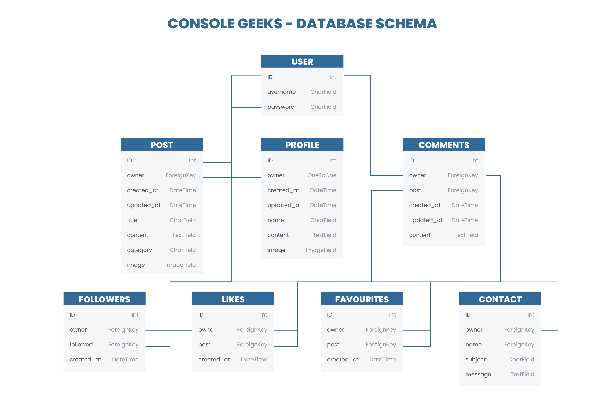

# CONSOLE GEEKS - API

## Links to Repositories and Live Sites

[Live site for the Back End](https://ck-fsd-console-geeks.herokuapp.com/)

[Live site for the Front End](https://ck-fsd-console-geeks-pp5.herokuapp.com/)

[Front End Respository](https://github.com/ChrisKellFSD/console-geeks)

## Table of Contents

- [Design](<#design>)
	- [User Stories](<#user-stories>)
	- [Database Schema](<#database-schema>)
	- [Details](<#details>)
        - [User](<#user>)
	    - [Profile](<#profile>)
	    - [Post](<#post>)
        - [Follower](<#follower>)
		- [Comment](<#comment>)
	    - [Like](<#like>)
		- [Favourite](<#favourite>)
        - [Contact](<#contact)
- [Technologies](<#technologies>)
	- [Development Technologies](<#development-technologies>)
	- [Testing Technologies](<#testing-technologies>)
- [Django](<#django>)
	- [Project Setup](<#project-setup>)
	- [Custom API with DRF](<#custom-api-with-drf>)
	- [JWT Tokens](<#jwt-tokens>)
- [Deployment](<#deployment>)
    - [Heroku](<#heroku>)
- [Issues and Fixes](<#issues-and-fixes>)
- [Testing](<#testing>)
	- [Manual Testing](<#manual-testing>)
	- [Validation](<#validation>)
- [Credits and Resources](<#credits-and-resources>)
	- [Code](<#code>)

## Design

### User Stories
The API was designed using the back end to achieve the user stories mentioned in the front end of the 'Console Geeks' project. The backend focuses on administration and can be described as one user story:

As an admin, I want to be able to create, edit and delete the users, posts, comments and likes, so that I can have full control the application using its CRUD features.

### Database Schema
The database was built using the Django Rest Framework. It makes use of Django models, serializers, and views. The Data Schema was designed as shown below:

### Details

User

- One-to-one relation with the Profile model owner field
- ForeignKey relation with the Post model owner field
- ForeignKey relation with the Follower model owner_following and followed fields
- ForeignKey relation with the Comment model owner field
- ForeignKey relation with the Like model owner field
- ForeignKey relation with the Favourite model owner field
- ForeignKey relation with the Contact model owner field

Profile

- The Profile model contains the following fields: ID, owner, created_at, updated_at, name, content and image
- One-to-one relation between the owner field and the User model id field

Post

- The Post model contains the following fields: ID, owner, created_at, updated_at, title, content, category and image
- ForeignKey relation with the Comment model post field
- ForeignKey relation with the Like model post field
- ForeignKey relation with the Favourite model post field

Follower

- The Follower model contains the following fields: ID, owner, following and created_at
- ForeignKeyUser relation between the following and the User model id field
- ForeignKeyUser relation between the followed field and the User model post field

Comment

- The Comment model contains the following fields: ID, owner, post, created_at, updated_at and content
- ForeignKeyUser relation between the owner field and the User model id field
- ForeignKeyUser relation between the post field and the User model post field

Like

- The Like model contains the following fields: ID, owner, post and created_at
- ForeignKey relation between the ID field and the User model id field
- ForeignKey relation between the owner field and the User model id field
- ForeignKey relation between the post field and the Post model post field

Favourite

- The Favourite model contains the following fields: ID, owner, post and created_at
- ForeignKey relation between the ID field and the User model id field
- ForeignKey relation between the owner field and the User model id field
- ForeignKey relation between the post field and the Post model post field

Contact

- The Contact model contains the following fields: ID, owner, name, subject and message
- ForeignKey relation between the ID field and the User model id field
- ForeignKey relation between the owner field and the User model id field

### Development Technologies

**Languages**
- [Python](https://en.wikipedia.org/wiki/Python_(programming_language))

**Frameworks & Libraries**

- [Django](https://www.djangoproject.com/) - to build the database
- [Cloudinary](https://cloudinary.com/) - to store and serve files
- [Pillow](https://python-pillow.org/) - imaging library used to enable image fields in the Profile, Post and Recommendation models
- [Django rest auth](https://django-rest-auth.readthedocs.io/en/latest/) - to implement account authorisation
- [Django Rest Framework](https://www.django-rest-framework.org/) -  to develop the API that works in conjunction with the database
-- [django-filter](https://django-filter.readthedocs.io/en/stable/) - used to enable filtering of resources

**Tools**

- [Figma](https://figma.com/) - to create a diagram of the Database Schema
- [Gitpod](https://www.gitpod.io/) - to code and develop the website
- [Git](https://git-scm.com/) – for version control (Gitpod terminal to commit to Git, and pushing to GitHub)
- [GitHub](https://github.com/) – to store the source code 
- [Heroku](https://www.heroku.com/) - to host and deploy the live website
- [Random Key Generator](https://randomkeygen.com/) - to generate secret key for Django 
- [Screen2Gif](https://www.screentogif.com/) - to capture an area of desktop and save it directly to .GIF (for viewing in web browsers). All the testing gifs have been generated using this tool.

### Testing Technologies

Only Manual Testing was attempted due to really less time available to set up the whole project. Automated testing is still in my to do list.

[Back to top ⇧](#contents)

## Django

### Project Setup
Django Rest Framework (DRF) was used to create this API. DRF project was set up and many necessary dependencies were installed following these steps:

1. Within your development environment/terminal, install Django with: `pip3 install 'django<4'` to install Django framework.
2. The code at terminal `pip3 install <package>` was used to install different dependencies:
- `pip3 install django-cloudinary-storage`- for Cloudinary to store uploaded image files
- `pip3 install Pillow` - To allow ImageFields to be used in the database models
- `pip3 install djangorestframework`- To install Django Rest Framework

3. Once these dependencies are installed, requirements.txt is updated using: `pip3 freeze > requirements.txt`. 
4. New Django project using the command `django-admin startproject <your-project-name> .` (dot at the end is necessary create it in root directory).
5. Add your installed apps to the `settings.py` file INSTALLED_APPS variable. The required lines are:
~~~
'cloudinary_storage',
'cloudinary',
~~~
6. To configure cloudinary, the following variables need to be set in settings.py: 
- `CLOUDINARY_STORAGE`: this should be set to your own cloudinary URL. Create env.py file in root directory and create a`CLOUDINARY_URL` environment variable in an env.py file like this
~~~
import os

os.environ['CLOUDINARY_URL'] = 'cloudinary:<url from personal cloudinary account>
~~~

and import this into the settings.py file using:
~~~
import os
if os.path.exists('env'):
    import env
~~~
 
`CLOUDINARY_STORAGE` is to be set to: `{'CLOUDINARY_URL': os.environ.get('CLOUDINARY_URL')}` which retrieves the env.py variable in a development environment, but also allows a Config Var to be set in Heroku for later deployment to Heroku.

- `MEDIA_URL`: this is set to '/media/' in this project
- `DEFAULT_FILE_STORAGE`: is to be set to 'cloudinary_storage.storage.MediaCloudinaryStorage'

7. . Whilst in the `env.py` file, create a `SECRET_KEY` variable which will be used later for Heroku deployment. To generate a new Django secret key, do a google search for a random key generator and use one of the results to create a key. The variable can be created using: 
~~~
os.environ ["SECRET_KEY"] = "<copy and paste the secret key>"
~~~
Back in settings.py, find the `SECRET_KEY` variable and replace the assignment as follows:
~~~
SECRET_KEY = os.environ.get('SECRET_KEY')
~~~
At the terminal
~~~
git add .
git commit -m "initial commit"
git push
~~~

- App Creation
After creation of new App using `python3 manage.py startapp <app>`, it must be added to installed apps in settings.py.

- Once the database models are created in 'models.py' file, they must be registered in 'admin.py' file of the respective app directory. Later the migrations must be made to the database.

### Custom API with DRF
To create APIs using Django Rest Framework. These steps are to be followed 

**Installation**
Within the development environment, these dependencies also need to be installed with :
- `pip3 install djangorestframework`- installs the Django Rest Framework
- `pip3 install django-filter`- allows filtering, searching and sorting of API data

In `settings.py` file go to INSTALLED_APPS variable and add:
~~~
'rest_framework',
'django_filters',
~~~
After installation, generate a requirements.txt document. 

**Serializers**

"Serializers allow complex data such as querysets and model instances to be converted to native Python datatypes that can then be easily rendered into JSON, XML or other content types." -- [source](https://www.django-rest-framework.org/api-guide/serializers/#serializers). These work similarly to Django's Form and ModelForm classes.

- Serializers are declared to serialize and deserialize data that corresponds to Model objects.
- In order to return complete object instances based on the validated data .create() and .update() methods are used.
- 

**Views**

Throughout in the DRF views.py file, GenericAPIView was used.
"Using the APIView class is similar to a regular View class, as usual, the incoming request is dispatched to an appropriate handler method such as .get() or .post(). Additionally, a number of attributes may be set on the class that control various aspects of the API policy." - [source](
https://www.django-rest-framework.org/api-guide/views/)

To control the basic view behavior these attributes were used [(source)](https://www.django-rest-framework.org/api-guide/generic-views/): 
- serializer_class - The serializer class used for validating and deserializing input, and for serializing output.
- permission_class - To allow only user to be able to access the view
- queryset - The queryset is used for returning objects from this view.
- filter_backends - A list of filter backend classes are used for filtering the queryset. Defaults to the same value as the DEFAULT_FILTER_BACKENDS setting. 

Install Django Filters: `pip3 install django-filter`
In settings.py, in templates add: 'django-filters'
Then update dependencies using `pip3 freeze > requirements.txt`

Additionally generate a view to render in 'views.py' file and create and wire up 'urls.py' in the respective directory. Then in 'urls.py' of project directory, for Class-based views
- Add a URL to urlpatterns:  path('', Home.as_view(), name='home')

### JWT Tokens 

To configure and enable JWT Tokens, the following steps were folowed:

1. Install the dj-rest-auth package for JWT tokens using `pip3 install djangorestframework-simplejwt`
2. Create a session authentication value for differentiating between Development and Production environments, this should be added to the env.py file: `os.environ['DEV'] = '1'`
3. Use the session authentication value in settings.py to determine whether to use SessionAuthentication (for in Dev) or JWT Tokens (for in Production) using the following:
~~~
REST_FRAMEWORK = {
    'DEFAULT_AUTHENTICATION_CLASSES': [( 
        'rest_framework.authentication.SessionAuthentication' 
        if 'DEV' in os.environ 
        else 'dj_rest_auth.jwt_auth.JWTCookieAuthentication'
    )]
}
~~~
4. Add `REST_USE_JWT = True` to enable token authentication
5. Add `JWT_AUTH_SECURE = True` to ensure tokens are only sent over HTTPS
6. Give cookie names to the access and refresh tokens using:
~~~
JWT_AUTH_COOKIE = 'my-app-auth'
JWT_AUTH_REFRESH_COOKIE = 'my-refresh-token'
~~~

## Deployment

### Heroku
For steps I referred to the Code Institute DRF API walkthrough project.

## Issues and Fix

- Issue 1:

[Back to top ⇧](#contents)

## Testing

### Manual Testing
This user story as an admin was tested:
"As an admin, I want to be able to create, edit and delete the users, posts, comments and likes, so that I can have full control the application using its CRUD features."

**Results are enlisted in the table**

**Test** | **Action** | **Expected Result** | **Test Result**
-------- | ------------------- | ------------------- | -----------------
User | Update and/or delete user | A user can be updated and/or deleted |**Pass**
Profile | Update and/or delete profile | A users' profile can be updated and/or deleted | **Pass**
Post | Create/ Update and/or delete post | A post can be created/ edited and/or deleted | **Pass**
Recommendation | Create/ Update and/or delete recommendation | A recommendation can be Created/ Updated and/or deleted | **Pass**
Comments | Create/ Update and/or delete comment | A comment can be Created/ Updated and/or deleted | **Pass**
Likes | Create/ Change and/or delete Likes | A Like can be Created/ Changed and/or deleted | **Pass**
Followers | Create/ Change and/or delete followers | Followers can be Created/ Changed and/or deleted | **Pass**

The tests for CRUD features were run on Django Rest Framework(DRF-UI) and on Django-Admin panel. The details are as follows:

### Validation

#### Pep8 Validation
The Python code has been validated using [Pep8 Validation Service](http://pep8online.com/) - no errors or warnings were found.
There were no errors found. The full report can be found [here](docs/validations/CI_python_linter_backend.pdf)

[Back to top ⇧](#contents)

## Credits and Resources
- Django REST Framework Documentation
- The codes were highly and heavily rely on CI's DRF-API walkthrough.
- Stack Overflow

## Acknowledgements

- A very 

[Back to top ⇧](#contents)